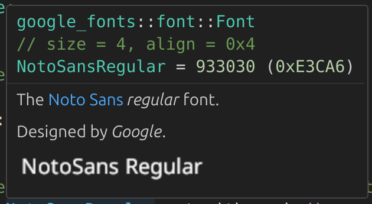

# google-fonts

Download and cache TTF fonts from Google.

There are `1,708` font families, and `11,689` fonts.

# Example

Download font data with a few approaches.

```rust
use google_fonts::lemonada_variable;
use google_fonts::Font::NotoSansRegular;
use google_fonts::Font::RobotoRegular;
use ttf_parser::Face;

fn main() {
    // Get and cache font data with a named function.
    let font_data = lemonada_variable().unwrap();
    let face = Face::parse(&font_data, 0).unwrap();
    eprintln!("Font data: {:?}", face);

    // Get and cache font data with an enum variant function.
    let font_data = NotoSansRegular.get_with_cache().unwrap();
    let face = Face::parse(&font_data, 0).unwrap();
    eprintln!("Font data: {:?}", face);

    // Get font data without caching by using an enum variant function.
    let font_data = RobotoRegular.get().unwrap();
    let face = Face::parse(&font_data, 0).unwrap();
    eprintln!("Font data: {:?}", face);
}
```

# Crate features

`full`, `variable`, and `static` crate features are available.
* `variable` enables only fonts with [variable font technology](https://fonts.google.com/knowledge/using_variable_fonts_on_the_web).
* `static` enables only fonts with _static font technology_.
* `full` enables both `variable` and `static` features.

`full` is the default feature.

Variable font technology is newer, more flexible, and provides style variations in one or two files. Static font technology uses more font files for each style variation. A majority of the fonts are in the `static` feature.

Enable the `variable` feature to significantly reduce build time and crate size.

# Doc comment font images

View font images from doc comments.

